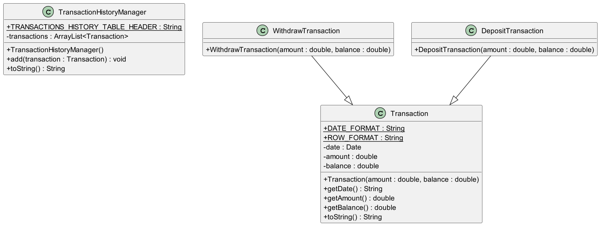
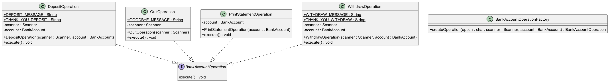
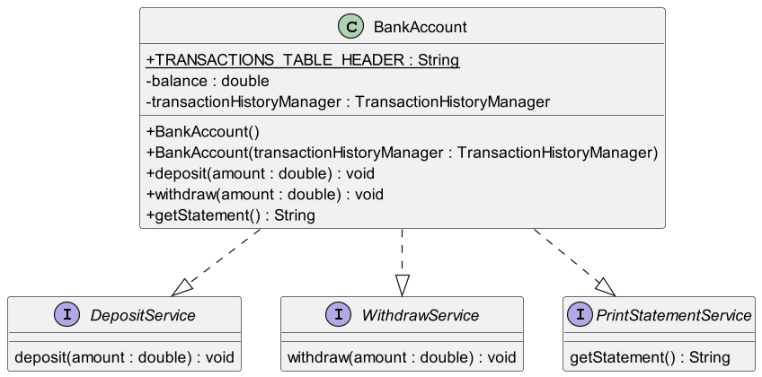
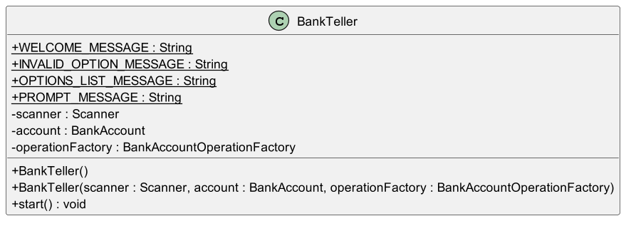
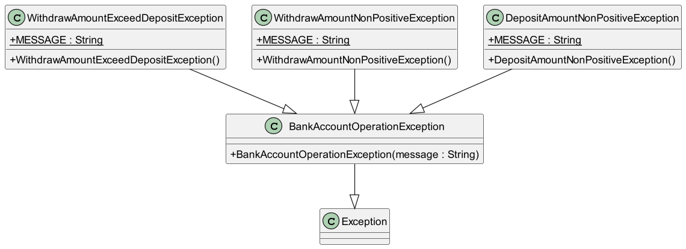
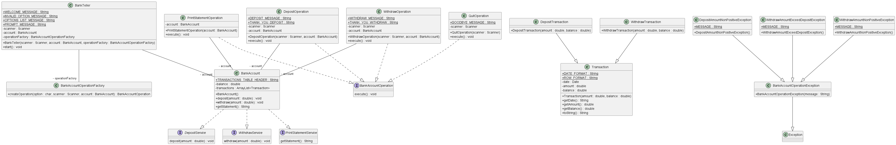
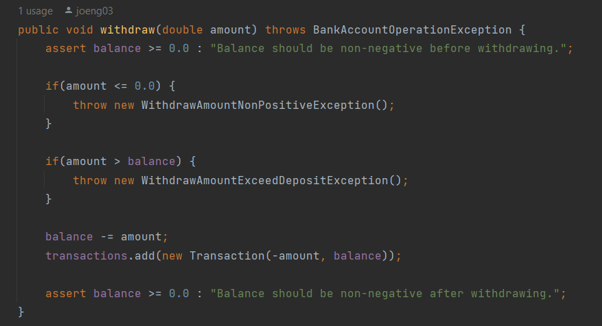

# 🏦 AwesomeGIC Bank: Documentation

## User stories

| ID | As a | I want to... | So that I can... |
| --- | --- | --- | --- |
| 1 | Customer | be welcomed to AwesomeGIC Bank when I launch the application | know I am interacting with the bank's system |
| 2 | Customer | have the option to deposit money into my bank account | increase my account balance |
| 3 | Customer | have the option to withdraw money from my bank account | access my funds when needed |
| 4 | Customer | receive confirmation when I deposit or withdraw money from my bank account | know the transaction was successful |
| 5 | Customer | receive appropriate error messages when the transaction is unsuccessful | understand the reason for the unsuccessful transaction, then respond accordingly |
| 6 | Customer | print a statement of my bank account transactions | keep track of my financial activities |
| 7 | Customer | have the bank statement display the date, amount, and current balance for each transaction | have complete information about my account history |
| 8 | Customer | be able to quit the banking application when I am done with my transactions | exit the program gracefully |
| 9 | Customer | receive a farewell message when I quit the banking application | feel appreciated as a customer of AwesomeGIC Bank |

## Overview of the Codebase

### Directory Structure

```c
│   BankTeller.java
│   Main.java
│
├───accounts
│       BankAccount.java
│       DepositService.java
│       PrintStatementService.java
│       WithdrawService.java
│
├───bank_account_operations
│       BankAccountOperation.java
│       BankAccountOperationFactory.java
│       DepositOperation.java
│       PrintStatementOperation.java
│       QuitOperation.java
│       WithdrawOperation.java
│
├───exceptions
│       BankAccountOperationException.java
│       DepositAmountNonPositiveException.java
│       WithdrawAmountExceedDepositException.java
│       WithdrawAmountNonPositiveException.java
│
└───transactions
        DepositTransaction.java
        Transaction.java
        WithdrawTransaction.java
```

### **Transaction**s



A class that keeps track of the details of a single transaction, such as date, amount, and balance. There are 2 types of **Transaction**s, which are `WithdrawTransaction` and `DepositTransaction`.

### Bank Account Operations



The 4 main operations, **Deposit**, **Withdraw**, **PrintStatement,** and **Quit**, all implement the **execute()** method from the **BankAccountOperation** interface. **BankAccountOperationFactory** is a factory class that creates operations of type **BankAccountOperation** for the bank account. It applies the Factory Method design pattern.

### the BankAccount class



The **BankAccount** class implements the logic to support the main functionalities of a bank account, through the **deposit()**, **withdraw(),** and **getStatement()** methods. It keeps track of the current balance of the bank account and a historical list of **Transaction**s, ordered by transaction date.

### the BankTeller class



The BankTeller class plays the role of a bank teller in a real-world scenario, handling user requests and bank responses through I/O operations. It is the sole entry point to interact with a bank account.

### Exceptions



The exceptions focus on handling scenarios where the user input will result in an invalid state for the bank account, for example, depositing or withdrawing a non-positive amount of money, or withdrawing more than the existing deposit (we do not support loans yet!). These exceptions extend the abstract class **BankAccountOperationException,** which itself extends the **Exception** class.

### UML Diagram (Overview)



## **Software Engineering Principles**

### Single Responsibility

In this application, each class only has one responsibility and one reason to change. For example, the `BankAccount` class fully handles the logic of a bank account, the `BankTeller` class handles all user requests, the `Transaction` classes are responsible for storing individual transaction data, and the `Operation`classes each handle their respective scenario.

### **Open-closed Principle**

Classes in this application are designed such that they are open for extension but closed for modification. For example, the `Transaction` class could be extended to model different types of bank account transactions, like `PaymentTransaction` and `InterestTransaction`. The `BankAccount` class could be extended to model different type of bank accounts, like`FixedDepositBankAccount`, `SavingsBankAccount`, and `SalaryBankAccount`. This allows for flexibility and reduces the risk of introducing bugs when extending the system's functionality.

### Liskov Substitution

if class *A* is a subtype of class *B*, we should be able to replace *B* with *A* without disrupting the behavior of our program. In this application, this is achieved by correctly extending the behavior of the `BankAccountOperation` interface among its subclasses. The `execute()` method in `DepositOperation` and `WithdrawOperation` both throw the `BankAccountOperationException` that was defined in  `BankAccountOperation`, while in`PrintStatementOperation` and `QuiteOperation`, `execute()` does not throw the `BankAccountOperationException`. In either case, the behavior of the `execute()` method is successfully extended and we could replace any instance of type `BankAccountOperation` with an instance of its subclass.

### Interface Segregation

We split larger interfaces into smaller ones. This could be shown in the implementation of the`BankAccount` class, where it implements 3 interfaces, `DepositService`, `WithdrawService`, and `PrintStatementService`, each with their corresponding functions. By doing so, we can ensure that implementing classes only need to be concerned about the methods that are of interest to them.

### Dependency Inversion

For example, the `BankTeller` constructor takes in `Scanner`, `BankAccount`, and `BankAccountOperationFactory` such that it depends on the abstractions of these classes instead of directly depending on them. This way, we could achieve low coupling because instead of high-level modules depending on low-level modules, both will depend on abstractions.

## Code Quality

- Application of Single Level of Abstraction Principle (SLAP).
- Use of guard clauses to keep the happy path prominent.
- No magic numbers and string literals, abstracted them out as constants instead.
- Widespread coverage and correct format of Javadoc.

## Representation Invariants and Assertions



The representation invariant for the bank account is that balances must be non-negative at all times. This condition is asserted at the beginning and end of every mutating function (`deposit()` and `withdraw()`), at the beginning of every non-mutating function (`getStatement()`), and at the end of the constructor (`BankAccount()`). Through the extensive use of assertions, we greatly reduce the possibility of introducing bugs that violate the representation invariants during the development process.

## Performance

As opposed to using naive String concatenation, which results in a time complexity of **O(N²)** due to the immutability of `String` in Java, where **N** is the length of the final String, `StringBuilder` was used in`getStatement()` to provide **O(N)** time complexity when building the transaction table.

## Possible Future Enhancements

### Supporting Concurrency

Concurrent access from multiple clients is a critical scenario in a banking system. In a multi-client, concurrent environment, each client could be represented by a thread in the `BankTeller` thread pool. To achieve this, methods like `deposit()`, `withdraw()`, and `getStatement()` in the `BankAccount` class should be explicitly synchronized using the `synchronized` keyword. Outside synchronized blocks, shared data structures such as `ArrayList`, used to store transaction history, must be synchronized using the Java `Collections` library to avoid thread safety issues. By synchronizing access to these resources, we can safeguard against race conditions, thus maintaining the integrity of bank account data.

### Supporting Different Types of Bank Accounts

To accommodate various types of bank accounts like `FixedDepositBankAccount`, `SavingsBankAccount`, and `SalaryBankAccount`, it's essential to abstract common attributes and methods from the current BankAccount class into an abstract class or multiple interfaces. This abstraction allows all bank account types to extend the behavior of the base class or implement the required interfaces, ensuring consistency across different account types while enabling specific functionalities unique to each account type.

### Testing the Application

Unit testing and integration testing are essential components of ensuring the reliability and correctness of the banking application.

### Unit Testing

1. **Deposit Functionality**: Unit tests should verify that the deposit functionality works as expected. This includes:
    - Testing depositing various amounts of money.
    - Checking that the balance is updated correctly after each deposit.
    - Ensuring that appropriate error handling is in place for invalid inputs.
2. **Withdrawal Functionality**: Unit tests should cover all aspects of the withdrawal functionality, such as:
    - Testing withdrawals of different amounts.
    - Verifying that the balance is updated correctly after each withdrawal.
    - Checking for insufficient funds scenarios and appropriate error handling.
3. **Print Statement Functionality**: Unit tests should validate the print statement functionality by:
    - Verifying that the printed statement contains the correct transaction details.
    - Ensuring that the statement includes the appropriate header and formatting.
4. **Quit Functionality**: Although straightforward, unit tests should confirm that the application exits gracefully when the user chooses to quit.

### Integration Testing

Integration tests should simulate the entire user interaction flow from start to finish, including:

- Launching the application.
- Performing multiple deposits, withdrawals, and printing statements.
- Exiting the application.

1. **Error Handling**: Integration tests should verify that the application handles errors gracefully, such as invalid user inputs or unexpected system behavior.
2. **Concurrency**: If the application supports concurrent access, integration tests should ensure that concurrent operations do not result in data corruption or inconsistencies.
3. **Input/Output Validation**: Integration tests should validate that the application correctly interprets user inputs and generates the expected outputs.

By conducting comprehensive unit and integration tests, developers can ensure that the banking application functions as intended, providing users with a reliable and seamless banking experience while maintaining the security and integrity of their financial transactions.